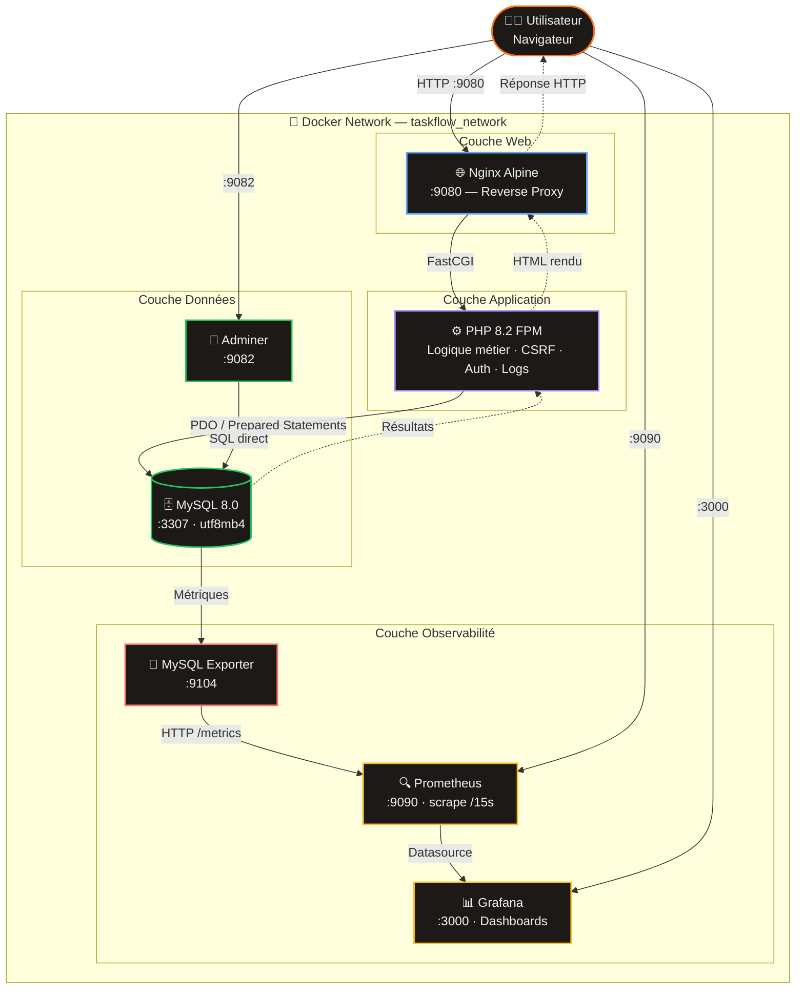
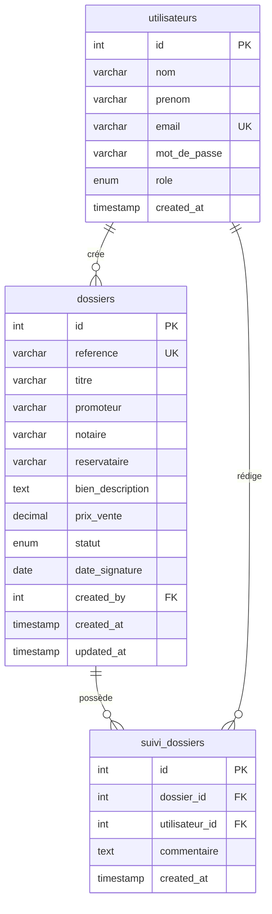

<div align="center">

# 🦊 TaskFlow — Gestion VEFA

**Plateforme de gestion de dossiers de Vente en État Futur d'Achèvement**

Développé par **Dannie Innocent Junior FIENI**  
Étudiant en Cybersécurité & Cloud Computing — IPSSI Nice

[](https://php.net)
[](https://mysql.com)
[](https://docker.com)
[](https://nginx.org)
[](https://prometheus.io)
[](https://grafana.com)
[](LICENSE)

</div>

---

##  À propos du projet

TaskFlow est une application web de gestion collaborative des dossiers VEFA, conçue pour faciliter le travail entre **notaires**, **promoteurs immobiliers** et **réservataires**.

Ce projet a été développé en **PHP 8.2 natif** pour maîtriser les fondamentaux, avec une infrastructure **DevOps complète** orchestrée via Docker Compose, incluant du monitoring en temps réel avec Prometheus et Grafana.

> **Contexte** : Projet de démonstration technique développé de manière autonome, visant à maîtriser la stack PHP/MySQL/Docker et les pratiques DevOps modernes dans un contexte métier réel (immobilier VEFA).

---

##  Méthodologie : éveloppement Agile (Scrum)

Ce projet a été conduit selon les principes **Agile/Scrum**, organisé en 3 sprints avec backlog, Definition of Done et rétrospective à chaque itération.

### Backlog produit

| Priorité | User Story | Sprint |
|----------|-----------|--------|
|  Must have | En tant que notaire, je veux voir tous mes dossiers en cours | Sprint 1 |
|  Must have | En tant qu'admin, je veux créer / modifier / supprimer un dossier | Sprint 1 |
|  Must have | En tant qu'utilisateur, je veux me connecter de façon sécurisée | Sprint 1 |
|  Should have | En tant qu'utilisateur, je veux filtrer et rechercher les dossiers | Sprint 2 |
|  Should have | En tant que notaire, je veux ajouter des notes de suivi horodatées | Sprint 2 |
|  Could have | En tant qu'admin, je veux monitorer l'infrastructure en temps réel | Sprint 3 |

---

### Sprint 1 — Core fonctionnel

**Objectif :** avoir une application utilisable avec authentification et CRUD opérationnels.

- Mise en place de l'architecture Docker (6 containers, réseau isolé)
- Base de données MySQL avec les 3 tables, clés étrangères et contraintes
- Authentification sécurisée : bcrypt, session, CSRF, rate limiting
- CRUD complet des dossiers VEFA (créer, lire, modifier, supprimer)
- Contrôle d'accès par rôle (admin / notaire / promoteur)

**Definition of Done**
- Login fonctionnel avec les 3 comptes de test
- 4 dossiers de démonstration créés en base
- Suppression admin avec CASCADE DELETE sur les notes liées
- Redirection automatique si non connecté sur toutes les pages

---

### Sprint 2 — Fonctionnalités métier & UX

**Objectif :** enrichir l'expérience utilisateur et couvrir les besoins métier complets.

- Filtres par statut (En cours / Signé / Archivé / Suspendu) avec compteurs
- Recherche full-text simultanée sur titre, référence, promoteur, notaire
- Journal de suivi collaboratif avec auteur et horodatage par dossier
- Interface dark theme responsive avec système de variables CSS
- Référence VEFA auto-générée (VEFA-YYYY-NNN)

**Definition of Done**
- Recherche "Schaaf" retourne exactement 2 résultats
- Les notes de suivi affichent le prénom, nom et la date de l'auteur
- Les badges de statut ont les bonnes couleurs (bleu / vert / gris / ambre)
- Interface fonctionnelle en dessous de 768px

---

### Sprint 3 — Sécurité & Monitoring

**Objectif :** durcir l'application et mettre en place l'observabilité complète.

- Couche sécurité centralisée (`security.php`) : headers HTTP, XSS, logs
- Blocage des fichiers sensibles (`.env`, `includes/`) au niveau Nginx
- Stack monitoring : Prometheus + Grafana + MySQL Exporter (auto-provisioning)
- Documentation GitHub : README, CONTRIBUTING, LICENSE MIT

**Definition of Done**
- `mysql_up = 1` confirmé dans Prometheus
- Headers `X-Frame-Options: DENY` et `X-Content-Type-Options: nosniff` visibles en DevTools
- Accès à `localhost:9080/.env` retourne **403 Forbidden**
- `logs/security.log` créé automatiquement après une tentative de connexion échouée

---

### Rétrospective

Un exemple concret d'amélioration continue entre les sprints : après le Sprint 1, les tests ont révélé que `dashboard.php` et `dossiers.php` n'incluaient pas la couche sécurité — les headers HTTP étaient donc absents sur ces pages. Corrigé en Sprint 3 en ajoutant `require_once 'includes/security.php'` et en complétant les règles Nginx pour le blocage de `includes/`. C'est précisément ce que permet l'Agile : livrer rapidement, tester, identifier les écarts, corriger.

---

##  Fonctionnalités

**Gestion métier**
- Authentification sécurisée avec sessions PHP et protection CSRF
- CRUD complet des dossiers VEFA (Créer / Lire / Modifier / Supprimer)
- Journal de suivi collaboratif avec commentaires horodatés par dossier
- Filtrage dynamique par statut (En cours, Signé, Archivé, Suspendu)
- Recherche full-text (titre, référence, promoteur, notaire simultanément)
- Dashboard avec statistiques en temps réel et valeur totale du portefeuille

**Sécurité**
- Protection CSRF — token unique par session sur tous les formulaires
- Requêtes préparées PDO — protection totale contre les injections SQL
- Hashage bcrypt des mots de passe via `password_hash()`
- Régénération de session à la connexion — protection contre la session fixation
- Rate limiting — 5 tentatives max par IP sur 5 minutes
- Headers HTTP de sécurité — X-Frame-Options, CSP, X-Content-Type-Options
- Logs de sécurité horodatés et par IP

**Infrastructure DevOps**
- Docker Compose orchestrant 6 containers dans un réseau isolé
- Prometheus — collecte de métriques MySQL toutes les 15 secondes
- Grafana — dashboard MySQL Overview avec auto-provisioning
- Adminer — interface d'administration de la base de données

---

## Architecture



---

##  Installation en 3 étapes

### Prérequis
- [Docker Desktop](https://www.docker.com/products/docker-desktop/) installé et démarré
- [Git](https://git-scm.com/) installé

```bash
# 1. Cloner le dépôt
git clone https://github.com/JuFiSec/taskflow-vefa.git
cd taskflow-vefa

# 2. Copier la configuration
cp .env.example .env

# 3. Lancer tous les services
docker-compose up -d
```

Attendre ~30 secondes le démarrage de MySQL, puis ouvrir l'application.

---

##  Accès aux services

| Service | URL | Identifiants |
|---------|-----|--------------|
| 🦊 TaskFlow | http://localhost:9080 | admin@taskflow.fr / password |
| 📊 Grafana | http://localhost:3000 | admin / taskflow123 |
| 🔍 Prometheus | http://localhost:9090 | — |
| 🗄️ Adminer | http://localhost:9082 | Serveur: `mysql` · User: `taskflow_user` · Pass: `taskflow_pass` |

---

##  Structure du projet

```
taskflow-vefa/
├── 📄 docker-compose.yml           # Orchestration des 6 containers
├── 📄 LICENSE                      # Licence MIT
├── 📄 .env.example                 # Template de configuration
│
├── 📁 docker/
│   ├── nginx/default.conf          # Config serveur web + règles de sécurité
│   ├── php/Dockerfile              # Image PHP 8.2 + extensions PDO
│   ├── prometheus/prometheus.yml   # Scraping toutes les 15s
│   └── grafana/provisioning/       # Auto-config datasource + dashboards
│
├── 📁 database/
│   └── init.sql                    # Schéma + données de démonstration
│
├── 📁 src/
│   └── config.php                  # Connexion PDO (pattern Singleton)
│
└── 📁 public/
    ├── layout.css                  # Système de design (variables CSS)
    ├── 📁 includes/
    │   ├── security.php            # CSRF · Rate limiting · Sanitisation · Logs
    │   └── sidebar.php             # Navigation réutilisable
    ├── index.php                   # Routeur d'entrée
    ├── login.php                   # Authentification sécurisée
    ├── logout.php                  # Destruction de session
    ├── dashboard.php               # Tableau de bord & statistiques
    ├── dossiers.php                # Liste · Filtres · Recherche
    ├── nouveau_dossier.php         # Création avec validation
    ├── voir_dossier.php            # Fiche détail + journal de suivi
    ├── modifier_dossier.php        # Édition sécurisée
    └── supprimer_dossier.php       # Suppression admin-only
```

---

## 🗄️ Schéma de base de données



---

## 🛡️ Sécurité

| Vulnérabilité | Contre-mesure |
|---|---|
| SQL Injection | Requêtes préparées PDO sur 100% des requêtes |
| XSS | `htmlspecialchars()` sur toutes les sorties HTML |
| CSRF | Token cryptographique `random_bytes(32)` par session |
| Brute Force | Rate limiting 5 req / 5 min par IP |
| Session Fixation | `session_regenerate_id(true)` à chaque connexion |
| Clickjacking | `X-Frame-Options: DENY` |
| MIME Sniffing | `X-Content-Type-Options: nosniff` |
| Info Disclosure | Suppression du header `X-Powered-By` |
| Accès fichiers sensibles | Blocage `.env` et `includes/` au niveau Nginx |
| Accès non autorisé | Vérification de rôle côté serveur sur chaque action sensible |

---

## 👤 Auteur

**Dannie Innocent Junior FIENI**

- 🎓 IPSSI Nice : Master Cybersécurité & Cloud Computing
- 🔗 GitHub : [@JuFiSec](https://github.com/JuFiSec)

---

##  Licence

Ce projet est sous licence **MIT** : voir le fichier [LICENSE](LICENSE) pour les détails.

---

<div align="center">

Fait avec rigueur et passion · 2026

</div>
